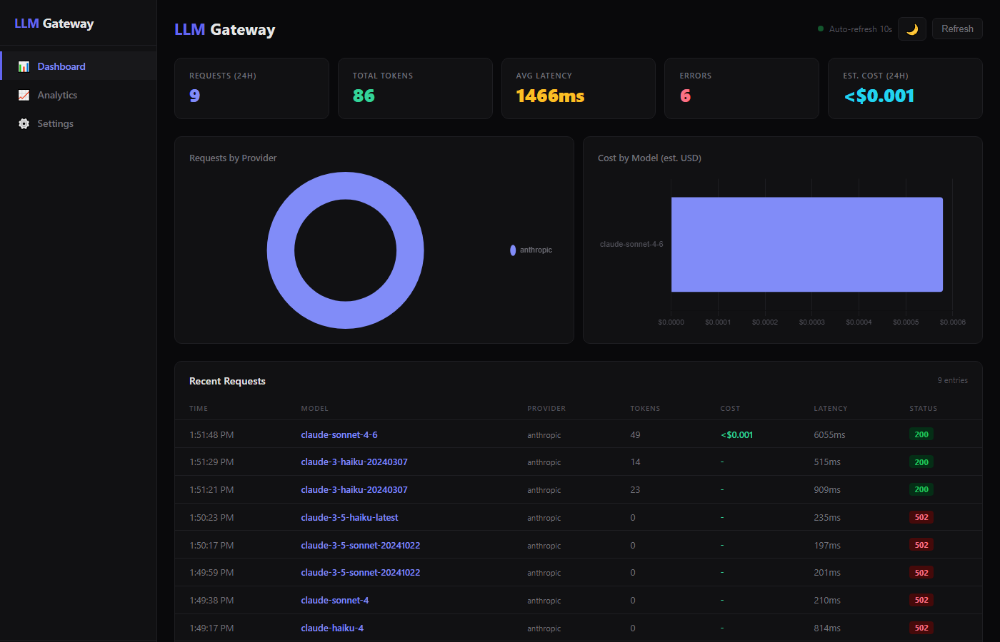
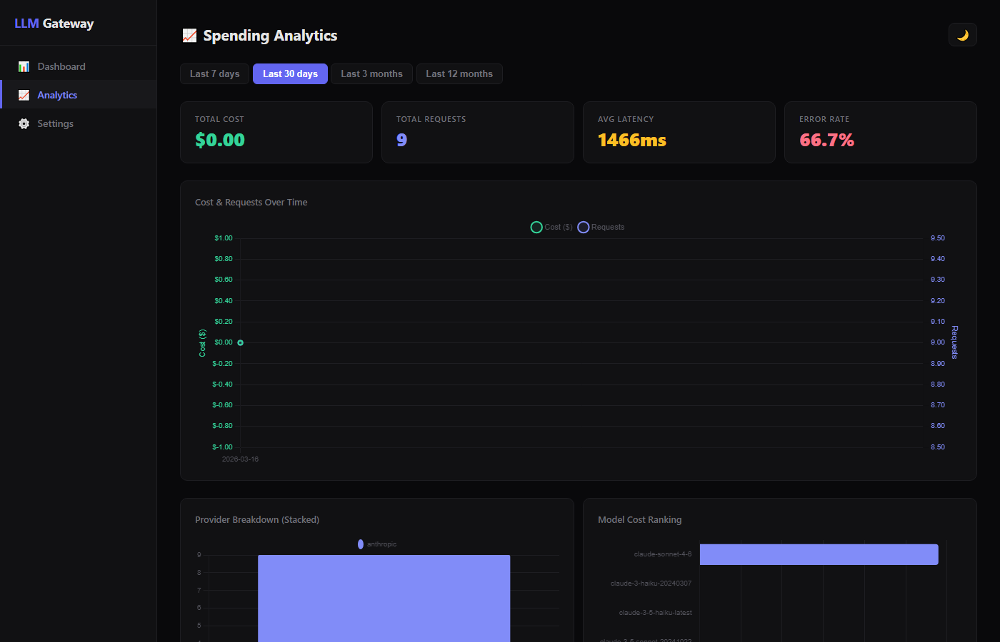
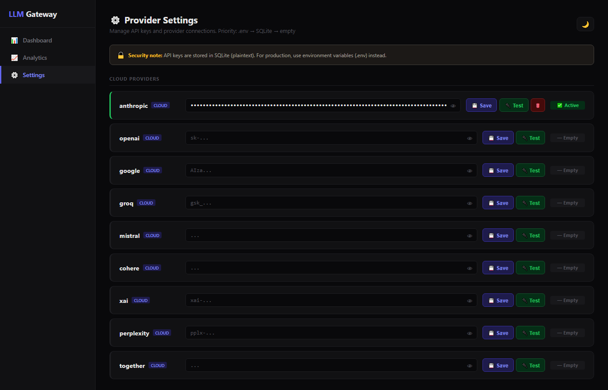

<p align="center">
  <h1 align="center">LLM Gateway</h1>
  <p align="center">
    Universal LLM proxy &mdash; one OpenAI-compatible API for <strong>12 providers</strong>.<br/>
    Single Go binary. SSE streaming. Admin dashboard. Zero config.
  </p>
</p>

<p align="center">
  <a href="https://hub.docker.com/r/scutontech/llm-gateway"></a>
  <a href="https://github.com/scuton-technology/llm-gateway/releases"></a>
  <a href="https://github.com/scuton-technology/llm-gateway/blob/main/LICENSE"></a>
  
</p>

<p align="center">
  
</p>

```
curl http://localhost:8080/v1/chat/completions → Anthropic / OpenAI / Gemini / Groq / Mistral / Cohere / xAI / Perplexity / Together / Ollama / LM Studio / vLLM
```

---

## Quick Start

**Docker (recommended):**

```bash
docker run -p 8080:8080 -v gateway-data:/data scutontech/llm-gateway
```

Open `http://localhost:8080` &rarr; set admin password &rarr; add API keys in Settings &rarr; done.

**Binary:**

```bash
git clone https://github.com/scuton-technology/llm-gateway.git
cd llm-gateway
go build -o llm-gateway ./cmd/gateway
./llm-gateway
```

---

## Usage

Send standard OpenAI-format requests. The gateway routes to the right provider automatically.

**Claude (Anthropic):**

```bash
curl http://localhost:8080/v1/chat/completions \
  -H "Content-Type: application/json" \
  -d '{
    "model": "claude-sonnet-4-6",
    "messages": [{"role": "user", "content": "Hello!"}]
  }'
```

**GPT-4o (OpenAI):**

```bash
curl http://localhost:8080/v1/chat/completions \
  -H "Content-Type: application/json" \
  -d '{
    "model": "gpt-4o",
    "messages": [{"role": "user", "content": "Hello!"}]
  }'
```

**Ollama (local):**

```bash
curl http://localhost:8080/v1/chat/completions \
  -H "Content-Type: application/json" \
  -d '{
    "model": "llama3",
    "messages": [{"role": "user", "content": "Hello!"}]
  }'
```

**SSE Streaming:**

```bash
curl -N http://localhost:8080/v1/chat/completions \
  -H "Content-Type: application/json" \
  -d '{
    "model": "claude-sonnet-4-6",
    "stream": true,
    "messages": [{"role": "user", "content": "Write a haiku about coding"}]
  }'
```

```
data: {"id":"msg_01X...","object":"chat.completion.chunk","choices":[{"delta":{"role":"assistant"}}]}
data: {"id":"msg_01X...","object":"chat.completion.chunk","choices":[{"delta":{"content":"Fingers "}}]}
data: {"id":"msg_01X...","object":"chat.completion.chunk","choices":[{"delta":{"content":"dance on keys"}}]}
data: [DONE]
```

All providers stream in **OpenAI SSE format** &mdash; even Anthropic and Gemini are translated on the fly.

---

## Supported Providers

| Provider | Models | Format | Streaming |
|----------|--------|--------|-----------|
| **Anthropic** | claude-sonnet-4-6, claude-opus-4-6, claude-haiku-4-5, claude-3-haiku | Messages API &rarr; OpenAI | Anthropic SSE &rarr; OpenAI SSE |
| **OpenAI** | gpt-4o, gpt-4o-mini, o1, o3-mini | Native | Pass-through |
| **Google** | gemini-2.0-flash, gemini-1.5-pro | Gemini API &rarr; OpenAI | Gemini SSE &rarr; OpenAI SSE |
| **Groq** | llama-3.3-70b, mixtral-8x7b | OpenAI-compatible | Pass-through |
| **Mistral** | mistral-large, mistral-small, codestral | OpenAI-compatible | Pass-through |
| **Cohere** | command-r-plus, command-r | Chat API &rarr; OpenAI | &mdash; |
| **xAI** | grok-2, grok-2-mini | OpenAI-compatible | Pass-through |
| **Perplexity** | sonar-large, sonar-small | OpenAI-compatible | Pass-through |
| **Together AI** | meta-llama/Llama-3-70b, etc. | OpenAI-compatible | Pass-through |
| **Ollama** | llama3, mistral, codellama, phi3 | OpenAI-compatible (local) | Pass-through |
| **LM Studio** | Any loaded model | OpenAI-compatible (local) | Pass-through |
| **vLLM** | Any served model | OpenAI-compatible (local) | Pass-through |

Model routing is automatic by prefix: `claude-*` &rarr; Anthropic, `gpt-*` &rarr; OpenAI, `gemini-*` &rarr; Google, etc.

---

## Features

### Admin Dashboard

Real-time metrics with Chart.js: requests, tokens, latency, cost, provider breakdown.

<p align="center">
  
</p>

### Spending Analytics

Historical cost tracking with timeline charts, provider stacked bars, model ranking, and CSV export.

<p align="center">
  
</p>

### Provider Settings

Add/test/delete API keys per provider via the web UI. Priority: `.env` &rarr; SQLite &rarr; empty.

<p align="center">
  
</p>

### SSE Streaming

All 11 streaming-capable providers emit **OpenAI-format SSE chunks**. Anthropic and Gemini streams are converted on the fly &mdash; your client code doesn't need to care which provider is behind the model.

### Admin Auth

- bcrypt password hashing (cost 12)
- HttpOnly session cookies (24h expiry)
- Brute force protection (5 attempts &rarr; 15 min lockout)
- First-run setup page at `/admin/setup`
- `--reset-password` CLI flag

### Dark / Light Mode

All pages support dark and light themes with system preference detection and localStorage persistence.

---

## Why LLM Gateway?

| | **LLM Gateway** | **LiteLLM** |
|---|---|---|
| **Language** | Go (single static binary) | Python |
| **Install size** | ~15 MB Docker image | ~500 MB+ with dependencies |
| **Startup time** | < 100ms | Several seconds |
| **Memory** | ~10 MB idle | ~100 MB+ idle |
| **Dependencies** | Zero (embedded SQLite) | pip, PostgreSQL/Redis optional |
| **Config** | Web UI + `.env` | YAML config files |
| **Dashboard** | Built-in (Chart.js) | Separate UI package |
| **Streaming** | Native SSE pass-through | Async Python generators |
| **Deployment** | `docker run` one-liner | Docker Compose + config |
| **Best for** | Self-hosted, low-resource, edge | Enterprise, complex routing |

LLM Gateway is designed for developers who want a **dead-simple, lightweight proxy** they can run anywhere &mdash; from a $5 VPS to a Raspberry Pi. No YAML configs, no Python virtualenvs, no external databases.

---

## API Endpoints

| Method | Path | Auth | Description |
|--------|------|------|-------------|
| `POST` | `/v1/chat/completions` | No | Proxy endpoint (OpenAI-compatible) |
| `GET` | `/health` | No | Health check + registered providers |
| `GET` | `/admin` | Yes | Dashboard UI |
| `GET` | `/admin/analytics` | Yes | Spending analytics UI |
| `GET` | `/admin/settings` | Yes | Provider settings UI |
| `GET` | `/admin/login` | No | Login page |
| `GET` | `/admin/setup` | No | First-run password setup |
| `GET` | `/api/dashboard` | Yes | Dashboard data (JSON) |
| `GET` | `/api/stats/daily` | Yes | Daily statistics |
| `GET` | `/api/stats/providers` | Yes | Provider breakdown |
| `GET` | `/api/stats/models` | Yes | Model cost ranking |

Every proxied response includes headers:
- `X-LLM-Provider` &mdash; which provider handled the request
- `X-LLM-Latency-Ms` &mdash; end-to-end latency in milliseconds

---

## Configuration

### Environment Variables

```bash
# Server
PORT=8080              # Server port (default: 8080)
DB_PATH=gateway.db     # SQLite database path

# Cloud Providers (set API key to enable)
ANTHROPIC_API_KEY=sk-ant-...
OPENAI_API_KEY=sk-...
GOOGLE_API_KEY=AIza...
GROQ_API_KEY=gsk_...
MISTRAL_API_KEY=...
COHERE_API_KEY=...
XAI_API_KEY=xai-...
PERPLEXITY_API_KEY=pplx-...
TOGETHER_API_KEY=...

# Local Providers (set ENABLED=true to activate)
OLLAMA_ENABLED=false
OLLAMA_BASE_URL=http://localhost:11434
LMSTUDIO_ENABLED=false
LMSTUDIO_BASE_URL=http://localhost:1234
VLLM_ENABLED=false
VLLM_BASE_URL=http://localhost:8000
```

### Web UI

You can also manage API keys from the **Settings** page at `/admin/settings`. Keys saved via the UI are stored in SQLite. Priority order: `.env` > SQLite > empty.

### Docker Compose

```yaml
services:
  llm-gateway:
    image: scutontech/llm-gateway:latest
    ports:
      - "8080:8080"
    volumes:
      - gateway-data:/data
    environment:
      - ANTHROPIC_API_KEY=sk-ant-...
      - OPENAI_API_KEY=sk-...

volumes:
  gateway-data:
```

### Password Reset

```bash
# Reset admin password (then visit /admin/setup)
./llm-gateway --reset-password

# Docker
docker exec <container> llm-gateway --reset-password
```

---

## Architecture

```
cmd/gateway/main.go              HTTP server, provider registration, auth setup
internal/
  providers/
    interface.go                  Provider + StreamProvider interfaces
    streaming.go                  SSE helpers, OpenAI passthrough stream
    openai.go                     OpenAI + Groq + Ollama + LM Studio + vLLM + Together
    anthropic.go                  Anthropic Messages API + stream conversion
    gemini.go                     Google Gemini API + stream conversion
    mistral.go                    Mistral (OpenAI-compat)
    cohere.go                     Cohere Chat API translation
    xai.go                        xAI Grok (OpenAI-compat)
    perplexity.go                 Perplexity Sonar (OpenAI-compat)
    registry.go                   Model -> provider resolution
  proxy/router.go                 Request routing, streaming dispatch
  admin/
    handler.go                    Dashboard + settings + analytics APIs
    auth.go                       Login, setup, session management
  middleware/logging.go           HTTP request logging
  storage/sqlite.go               SQLite: logs, settings, auth, analytics
web/
  dashboard.html                  Admin dashboard (Chart.js)
  analytics.html                  Spending analytics (Chart.js)
  settings.html                   Provider settings UI
  login.html                      Login page
  setup.html                      First-run setup page
```

---

## OpenAI SDK Compatibility

LLM Gateway works as a drop-in replacement with any OpenAI SDK:

**Python:**

```python
from openai import OpenAI

client = OpenAI(base_url="http://localhost:8080/v1", api_key="unused")

# Use any provider through the same client
response = client.chat.completions.create(
    model="claude-sonnet-4-6",  # Routes to Anthropic
    messages=[{"role": "user", "content": "Hello!"}]
)

# Streaming works too
for chunk in client.chat.completions.create(
    model="claude-sonnet-4-6",
    messages=[{"role": "user", "content": "Hello!"}],
    stream=True
):
    print(chunk.choices[0].delta.content, end="")
```

**Node.js:**

```javascript
import OpenAI from "openai";

const client = new OpenAI({
  baseURL: "http://localhost:8080/v1",
  apiKey: "unused",
});

const stream = await client.chat.completions.create({
  model: "claude-sonnet-4-6",
  messages: [{ role: "user", content: "Hello!" }],
  stream: true,
});

for await (const chunk of stream) {
  process.stdout.write(chunk.choices[0]?.delta?.content || "");
}
```

---

## License

MIT

---

<p align="center">
  Built by <a href="https://scuton.com">Scuton Technology</a>
</p>
